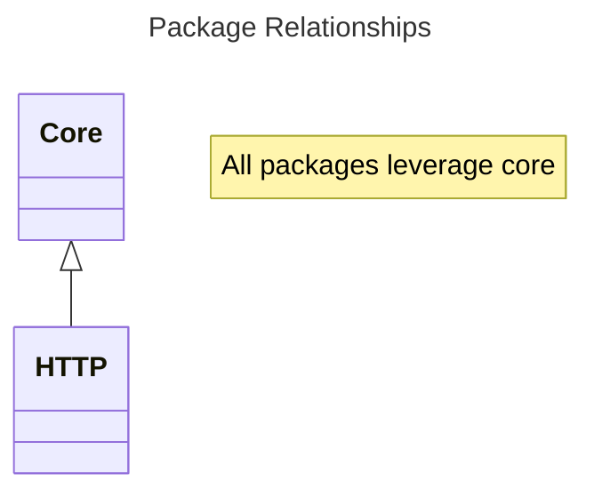

# Grandada Packages

The structure of the packages is intended to encapsulate specific domains of functionality into composable units that can be used to build your application, pulling in only what is needed to accomplish the task an no more (where possible).

