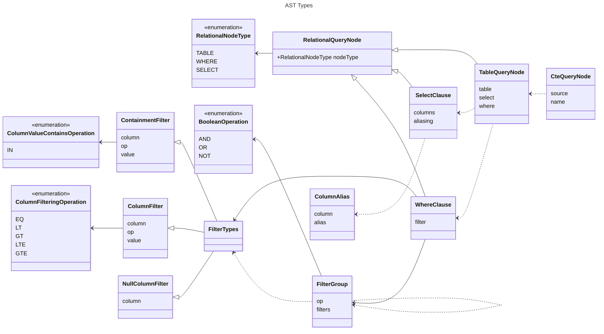

# Relational Data

This package is intended to try to represent some general concepts that exist in
most relational styles of queries and underlying providers. It is NOT intended
to be a fully compatible SQL implementation (or other relational variant) but
instead to provide some common functionality and nomenclature that can be parsed
into the corresponding systems.

## AST

The types in here extend the main `query/ast` package to provide relational
constructs that can be leveraged by concrete instances of the
`RelationalQueryBuilder` to generate `Query` objects for the target system
(Postgres, MySQL, DynamoDB, etc.). These are the runtime objects that will be
passed to the builders to allow it to create a valid query given the intent
represented in these objects. There is some type information that is held where
necessary but it is limited and not used to enhance the developer experience
while building queries themselves.

## Builder

This package contains the objects that developers would use when building
relational queries and is intended to capture intent (via the underlying AST)
whlie providing type hints and safety based on the operations being performed.
The type system is leveraged heavily here to ensure that the compile time
experience matches as closely to the underlying query intent as possible. Some
examples of that would be:

1. Allowing properties (columns) to be `aliased` to have a new name in the
   returned query types.
2. Providing type hints on filters (where clauses) to match up with the
   available columns on the target table.
3. Creating projections that are available to other subsequent operations in the
   given query (`CTE` style expressions as an example)

## Memory

This package contains a reference implementation of a `RelationalQueryBuilder`
that works on in-memory (collections) that are used to test the builder and AST
components as well as providing an example of how some of the concepts could be
built. It is not intended to be specifically preformant and I would `HIGHLY`
advise that you do not, under any circumstances, use it for anything outside of
a mocking implementation. Re-implementing a database in Typescript and NodeJS
sounds like another fun side project, but is not in scope for this framework
lol.

# Structure

Below is a set of diagrams that should be `correct-ish`. This basically means
that I update this when I make some changes but I also update often enough that
keeping them completely correct at the moment is a fools errand so I don't. It's
mean to give an idea of how things relate generally, but if you want to have a
current and correct view of the types, check out this [file](./builder.ts)

