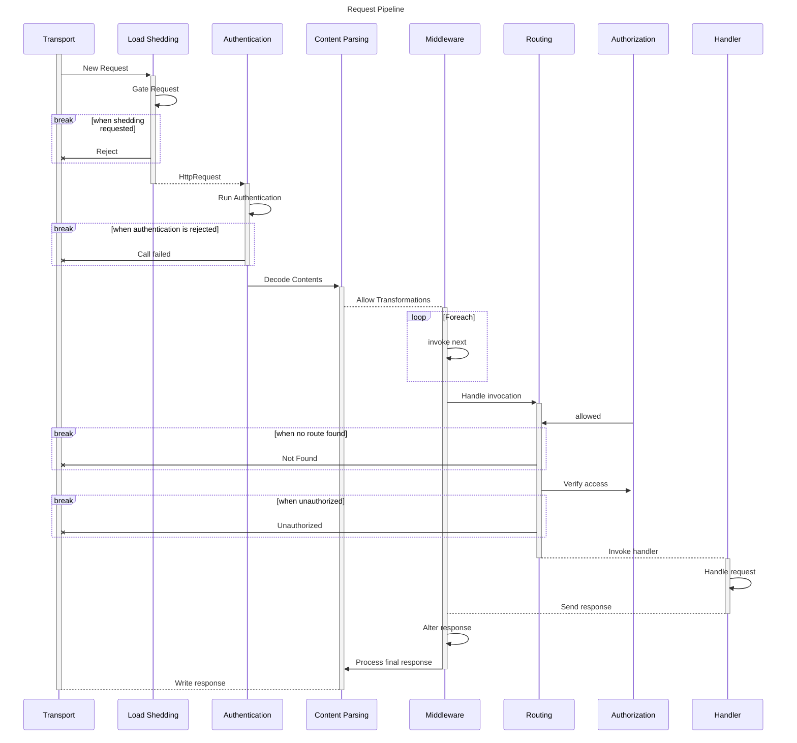

# HTTP

This package provides common patterns for working with the HTTP stack including:
- Servers
- Clients
- Content Parsing
- Load Shedding

## Server

### Http Request Processing Flow

The following diagram shows the core processes that are involved in handling a request and the main points where it may be stopped early due to authentication/authorization issues or load shedding.  This pipeline should look familiar as it follows a similar model to many other frameworks with the addition of the `Load Shedding` mechanism at the front of the stack and split of `Authentication` and `Authorization` stages which often can and should be processed separately after other processing and data hydration occur.

### Transport
This is hosted by the default Node implementation and supports the configured HTTP protocol and TLS exchange.  These mechanisms are abstracted via a custom representation of an `HttpRequest` and `HttpResponse` to allow easier interaction with other frameworks as well as ease of testing without the need for a fully functional server.

### Load Shedding
This component is responsible for detecting when the server is at capacity and can no longer accept new requests without violating it's SLA or exceeding downstream capacity.  In the event that there is too much volume coming into the server, rules can be triggered here to `shed` the current load, resulting in a 503 response and immediate abandoning of the request.

### Authentication
This stage is explicitly separated out and is responsible for extracting and validating any information about the source of the request and whether or not it is valid from the server perspective.  In practice this is usually done through mechanisms such as username/password combinations, JWT auth tokens or some other mechanism for identifying the source.  It's simply there to provide the answer to the question "Do I know and/or trust who this is coming from?"

### Content Parsing
Tihs component is responsible for handling things like compression, decoding and identification of the contents whlie formatting them in a way that can be easily consumed further downstream.  Generally anything that can be done lazily here will be to reduce reading or writing contents that are not requested for any given reason and to save CPU cycles until the system needs to expend them.  Generally this saves for timeout scenarios where processing the contents would be moot as the request has already been abandoned.

### Middleware
This component allows information about the Request (and subsequent response) to be decorated or otherwise altered before (or after) the handler receives it.  Generally this is used for adding contextual information that the server itself is unaware of but that are required for handlers further downstream.

### Routing
This component is responsible for inspecting the request and determining which handler should be used to fulfill it.  Generally this is done through path pattern matching but can be extended to use whatever logic is desired at this point to match a request to a given execution handler.

### Handler
This is the final component in the pipeline and where a request is transformed into a response that should be delivered back to the caller.  It is intentionally only loosely defined to allow the most flexibility in how users write their system and often can be a translation point between Granada and other frameworks when working with multiple frameworks.