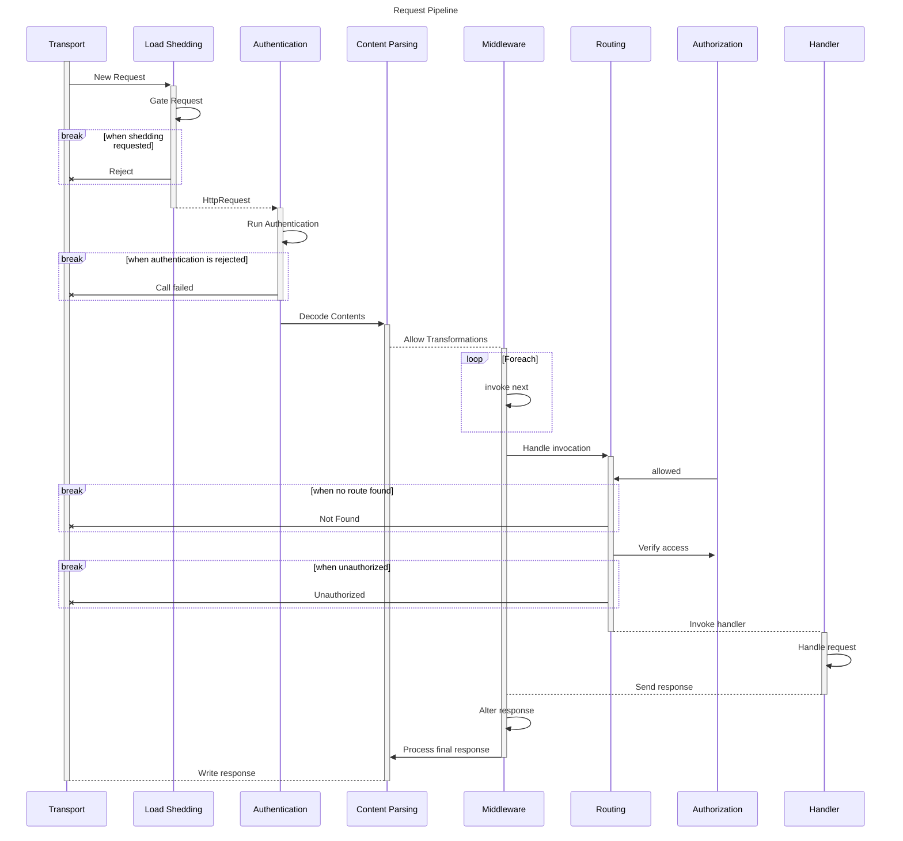

```
 _   _ _   _
| | | | | | |
| |_| | |_| |_ _ __
|  _  | __| __| '_ \
| | | | |_| |_| |_) |
\_| |_/\__|\__| .__/
              | |
              |_|
```

# HTTP

This package provides common patterns for working with the HTTP stack including:

- Servers
- Clients
- Content Parsing
- Load Shedding

## Patterns and Philosophy

This library is split into two main components:

1. The low level protocol aspects for HTTP (both client and server) represented
   as a series of interfaces, types and enumerations that are required to use
   this library.

2. A reference implementation of the protocol that is entirely based on
   available NodeJS tooling with no additional resources required.

The goal of this library is to expose a large number of concepts for underlying
HTTP scenarios through a series of layers that build on top of one another with
hook points for extensions but allowing users to find their level of
comfortability with the system and work there without having to understand the
internals beyond that. The lower bound on this library does not seek to
re-implement the HTTP transport at a raw socket level but attempts to leave that
open to potential extension by another consumer of the library if so chosen.

Another aspect of this library is the intent to model many of the operations
that can be done as a state machine to help prevent invalid transitions
regardless of the implemntation chosen with respect to the operation of a given
client/server. This is deemed to fit nicely with the way that the event loop
operates instead of long, unbounded processing stages that would be difficult to
still allow for some of the advanced concepts like: load shedding,
prioritization or request aborting.

Given the choice of a state machine, many of the operations are driven by events
at the lowest level while promises are preferred at later stages to make coding
easier for consumers at varying levels of the stack. It is also assumed that
operations can be cancelled at any time for a variety of reasons and state
checks on the objects makes this easier for consumers to abandon or not start
work that would not be useful.

## Common

There are several aspects of the HTTP transport protocol that are agnostic to
client and server paradigms including things like: headers, methods, content
types etc. These are intended to be as simple as possible to allow others to
extend and build upon them while respecting the underlying semantics of the
transport.

## Client

This is the main entrypoint for any HTTP Client impementations and includes the
underlying state machine for requests moving through this flow as well as
customizations to the common objects that are specific to client needs.

## Server

This is the main entrypoint for any HTTP Server implementation and includes the
underlying state machine for requests moving through this flow as well as
customizations to the common objects that are specific to server needs.

---

Needs re-work

### Http Request Processing Flow

The following diagram shows the core processes that are involved in handling a request and the main points where it may be stopped early due to authentication/authorization issues or load shedding. This pipeline should look familiar as it follows a similar model to many other frameworks with the addition of the `Load Shedding` mechanism at the front of the stack and split of `Authentication` and `Authorization` stages which often can and should be processed separately after other processing and data hydration occur.



### Transport

This is hosted by the default Node implementation and supports the configured HTTP protocol and TLS exchange. These mechanisms are abstracted via a custom representation of an `HttpRequest` and `HttpResponse` to allow easier interaction with other frameworks as well as ease of testing without the need for a fully functional server.

### Load Shedding

This component is responsible for detecting when the server is at capacity and can no longer accept new requests without violating it's SLA or exceeding downstream capacity. In the event that there is too much volume coming into the server, rules can be triggered here to `shed` the current load, resulting in a 503 response and immediate abandoning of the request.

### Authentication

This stage is explicitly separated out and is responsible for extracting and validating any information about the source of the request and whether or not it is valid from the server perspective. In practice this is usually done through mechanisms such as username/password combinations, JWT auth tokens or some other mechanism for identifying the source. It's simply there to provide the answer to the question "Do I know and/or trust who this is coming from?"

### Content Parsing

Tihs component is responsible for handling things like compression, decoding and identification of the contents whlie formatting them in a way that can be easily consumed further downstream. Generally anything that can be done lazily here will be to reduce reading or writing contents that are not requested for any given reason and to save CPU cycles until the system needs to expend them. Generally this saves for timeout scenarios where processing the contents would be moot as the request has already been abandoned.

### Middleware

This component allows information about the Request (and subsequent response) to be decorated or otherwise altered before (or after) the handler receives it. Generally this is used for adding contextual information that the server itself is unaware of but that are required for handlers further downstream.

### Routing

This component is responsible for inspecting the request and determining which handler should be used to fulfill it. Generally this is done through path pattern matching but can be extended to use whatever logic is desired at this point to match a request to a given execution handler.

### Handler

This is the final component in the pipeline and where a request is transformed into a response that should be delivered back to the caller. It is intentionally only loosely defined to allow the most flexibility in how users write their system and often can be a translation point between Granada and other frameworks when working with multiple frameworks.
